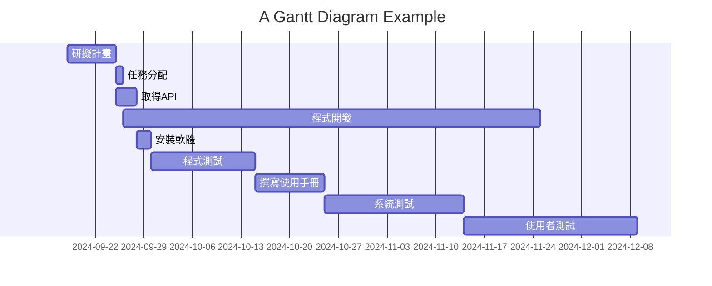
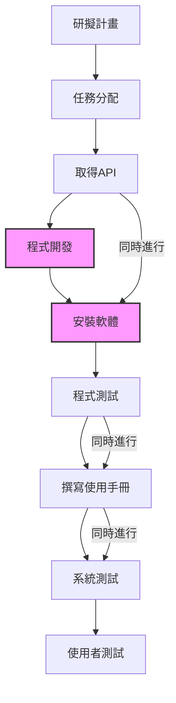
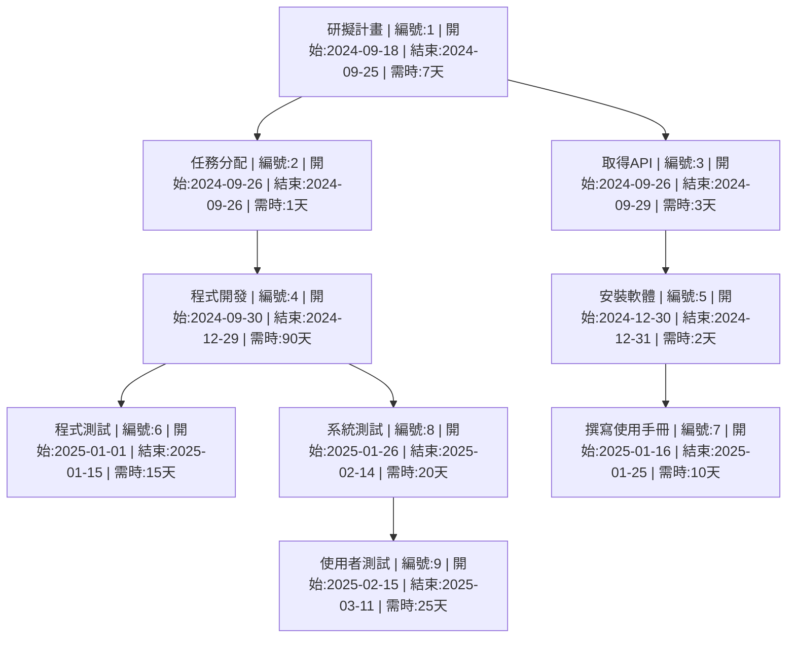

```mermaid
gantt
    title A Gantt Diagram Example

    dateFormat  YYYY-MM-DD
    axisFormat  %Y-%m-%d

    研擬計畫           :a1, 2024-9-18, 7d
    任務分配           :a2, after a1, 1d
    取得API           :a3, after a1, 3d

    程式開發           :a4, after a2, 60d
    安裝軟體           :a5, after a3, 2d

    程式測試           :a6, after a5, 15d
    撰寫使用手冊        :a7, after a6, 10d
    系統測試           :a8, after a7, 20d
    使用者測試         :a9, after a8, 25d
```

```mermaid
graph TD
    A["研擬計畫"] --> B["任務分配"]
    B --> C["取得API"]
    C --> D["程式開發"]
    D --> E["安裝軟體"]
    E --> F["程式測試"]
    F --> G["撰寫使用手冊"]
    G --> H["系統測試"]
    H --> I["使用者測試"]

    style D fill:#f9f,stroke:#333,stroke-width:2px
    style E fill:#f9f,stroke:#333,stroke-width:2px

    C -->|同時進行| E
    G -->|同時進行| H
    F -->|同時進行| G

```

```mermaid
graph TD
    no1["研擬計畫 | 編號:1 | 開始:2024-09-18 | 結束:2024-09-25 | 需時:7天"] --> no2["任務分配 | 編號:2 | 開始:2024-09-26 | 結束:2024-09-26 | 需時:1天"]
    no1 --> no3["取得API | 編號:3 | 開始:2024-09-26 | 結束:2024-09-29 | 需時:3天"]

    no2 --> no4["程式開發 | 編號:4 | 開始:2024-09-30 | 結束:2024-12-29 | 需時:90天"]
    no3 --> no5["安裝軟體 | 編號:5 | 開始:2024-12-30 | 結束:2024-12-31 | 需時:2天"]

    no4 --> no6["程式測試 | 編號:6 | 開始:2025-01-01 | 結束:2025-01-15 | 需時:15天"]
    no5 --> no7["撰寫使用手冊 | 編號:7 | 開始:2025-01-16 | 結束:2025-01-25 | 需時:10天"]
    no4 --> no8["系統測試 | 編號:8 | 開始:2025-01-26 | 結束:2025-02-14 | 需時:20天"]

    no8 --> no9["使用者測試 | 編號:9 | 開始:2025-02-15 | 結束:2025-03-11 | 需時:25天"]

```
